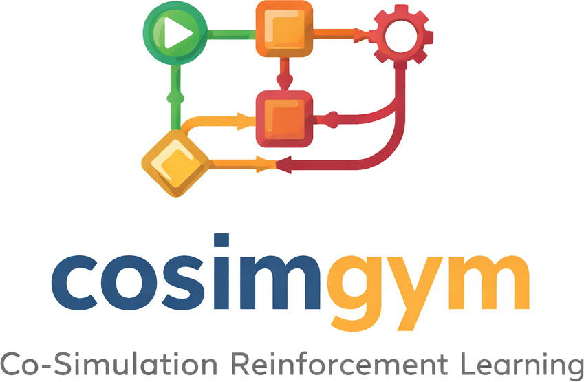
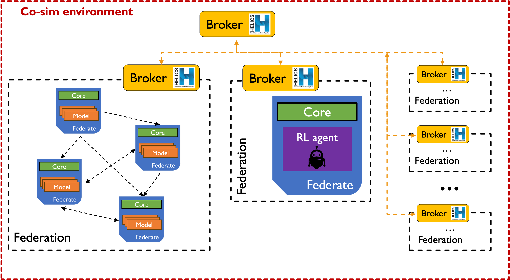

# CosimGym ⚠️ Under Developement

<!--  -->

**CosimGym** is a powerful orchestration framework that seamlessly bridges the gap between complex co-simulation environments and Reinforcement Learning (RL). 

**The Challenge:** Modern engineering systems—such as power grids, building energy systems, and robotic swarms—often rely on multiple interacting subsystems that are best modeled with specialized tools. **Co-simulation** (powered by the [HELICS](https://helics.org/) middleware) enables these heterogeneous models to run simultaneously and exchange data at every time step, providing a unified system-level perspective. 

 **The Solution:** By natively integrating **Gymnasium**, CosimGym translates complex publish/subscribe data exchanges into the standard `reset()` and `step()` paradigm. This allows RL agents to directly interact with, learn from, and control realistic, physics-based simulations without the heavy burden of networking and synchronization boilerplate.

## Documentation
The full CosimGym Documentation is available at [CosimGym]()

### Overview

With this framework you can setup co-simulation scenario by plugging your own models or reuse the community shared ones. The main orchestration mechanism relies on [HELICS](https://helics.org/) middleware and by wrapping those low level functionalities enables a standard and reproducible approach to plug and co-simulate models. In addition this framework is intended to be a Reinforcement Learning gym for training and testing your agents on composable realistic phisical environments.

### ✨ Main Features

- 📜 **Declarative YAML Scenarios**: Define complete simulation architectures, timing windows, multi-federation setups, and RL hyperparameters purely through YAML configuration files—*no hardcoded orchestration required*.
- ⚙️ **Automated Orchestration**: The `ScenarioManager` handles the heavy lifting: starting HELICS brokers, spawning individual federate processes, distributing configurations via **Redis**, managing time synchronization, and ensuring graceful shutdowns.
- 🧩 **Plug-and-Play Models**: Rely on a standardized `BaseModel` interface and a centralized Model Catalog to easily drop in custom physics models, data readers, FMUs, or arbitrary RL algorithms.
- 🤖 **Gymnasium Compatibility**: The built-in `HelicsGymEnv` wrapper automatically binds HELICS pub/sub variables to standard Observation and Action spaces, making it out-of-the-box compatible with popular RL libraries (e.g. stablebaseline3, RLlib).
- 🔄 **Flexible Workflows**: Run standard physics-only co-simulations, conduct live online RL training (with built-in agents like **DQN** or **SAC**), or evaluate pre-trained policies within a single unified framework.
- 📊 **Built-in Dashboard**: Monitor simulation metrics and analyze RL performance through an interactive, ready-to-use **Streamlit** dashboard.

---

## 🚀 Quick Start: Choose Your Way

In order to start using this repository there are different options listed and explained here [Installation]()

## Examples
Simple example of runnable testa cases:
- Simple spring mass damper system (single & multi-federation) --> [case0]()
- Building + Heatpump + Weather + PID controller --> [case1]()
- Building + Heatpump + Weather + RL agent (DQN/SAC) --> [case2]() , [case3]()
- PV + Battery + Load + Weather + RB controller -->  [case4]()
- PV + Battery + Load + Weather + RL controller (DQN/SAC)-->  [case5](), [case6]()

Published Applications:
    **Incoming** 

##  ⚠️ Disclaimer:
**This repository is in an early prototype stage. Testing is still ongoing, and the codebase is under active development. Expect changes, refactoring, and new features in the near future!**

## Contributing

Contributions, issues, and feature requests are welcome.
Feel free to open an issue or submit a pull request. A discussion session will be open so in this first stage start brainstorming there. This repo is meant to be a collective place for multidisciplinary exchanges.

## Cite This
**incoming**

---
### Acknowledgements
This project has been supported by the following institutions and organizations:

  <table>
    <tr>
      <td align="center" width="33%">
         
        <i>Politecnico di Torino</i>
      </td>
      <td align="center" width="33%">
         
        <i>Energy Center Lab EC-lab</i>
      </td>
    </tr>
   
  </table>

<!-- 
 
    <table>
    <tr>
      <td align="center" width="33%">
         
        <i>Politecnico di Torino</i>
      </td>
      <td align="center" width="33%">
         Replace src with your image path 
         
        <i>Partner 2 Name</i>
      </td>
      <td align="center" width="33%">
        Replace src with your image path 
         
        <i>Partner 3 Name</i>
      </td>
    </tr>
    <tr>
      <td align="center" width="33%">
        <!-- Replace src with your image path 
         
        <i>Partner 4 Name</i>
      </td>
      <td align="center" width="33%">
        <!-- Replace src with your image path 
         
        <i>Partner 5 Name</i>
      </td>
      <td align="center" width="33%">
        <!-- Replace src with your image path 
         
        <i>Partner 6 Name</i>
      </td>
    </tr>
  </table>

 -->